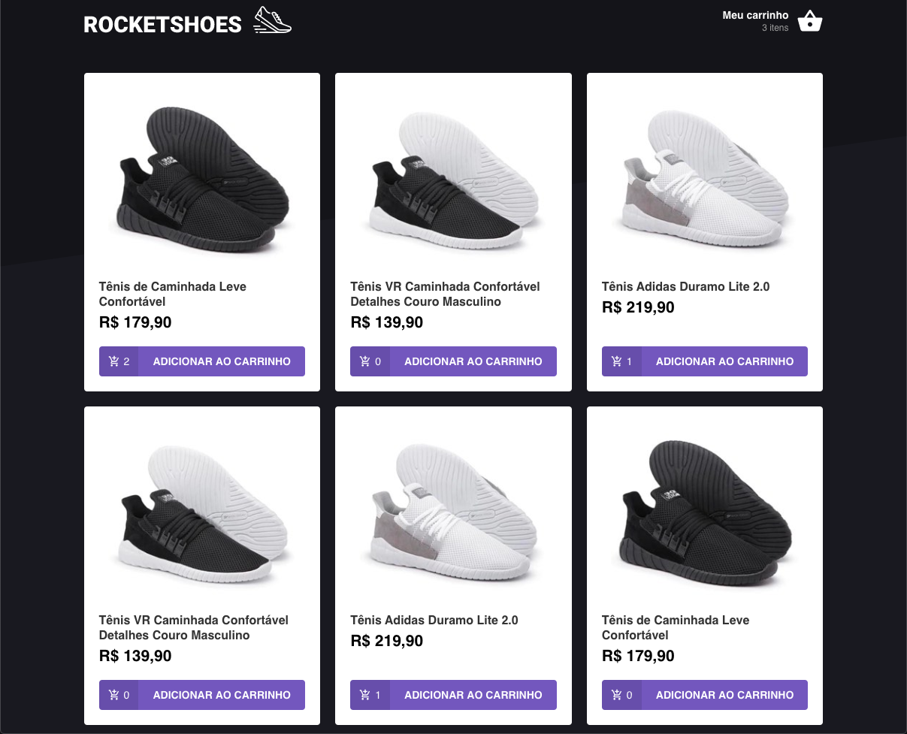
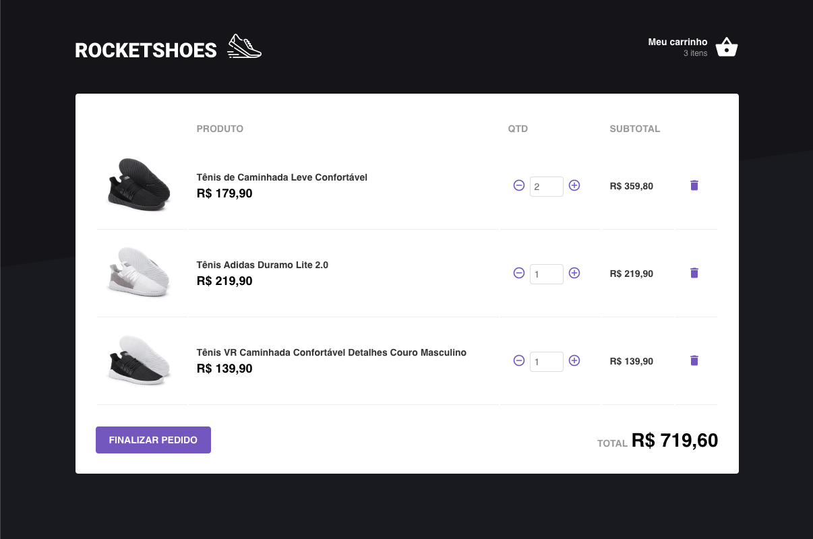

# Módulo 07: Arquitetura Flux

<h1 align="center">
    
</h1>

## About

A ecommerce store in reactjs

## Installation

Clone the project with

```sh
git clone https://github.com/cadohr/rocketseat-bootcamp-rocketshoes.git
```

Get in the project path

```sh
cd rocketseat-bootcamp-rocketshoes
```

Then install the dependencies with:

```sh
yarn
```

Start server with:

```sh
yarn server
```

Open new terminal tab and start application with:

```sh
yarn start
```

## Screenshot



